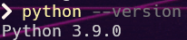

# ***Stori - Challenge***

## ***Introduccion***
Este reto fue realizado con **Robot Framework**.

**Robot Framework** es un marco de automatización de código abierto que puede ser utilizado tanto para la automatización de pruebas como para la automatización de procesos robóticos. Es apoyado por la **Fundación Robot Framework** y utilizado por muchas compañías líderes de la industria en su desarrollo de software. 

Es fácil de usar, con una sintaxis simple basada en palabras clave fácilmente comprensibles. También es altamente extensible y puede ser integrado con prácticamente cualquier otra herramienta, lo que permite soluciones de automatización poderosas y flexibles. Además, **Robot Framework** es gratuito y no requiere licencias costosas. Existe un rico ecosistema de bibliotecas y herramientas que son desarrolladas como proyectos separados y que complementan el marco.

[Clic aqui para mas informacion](https://robotframework.org/).

## ***Requerimientos***
Al momento de crear este proyecto fueron usados los siguientes componentes:

- [Python](https://www.python.org/downloads/) (3.9)
- [Robot Framework](https://robotframework.org/robotframework/latest/RobotFrameworkUserGuide.html) (6.0.2)
- [SeleniumLibrary](https://github.com/robotframework/SeleniumLibrary) (6.0.0)
- [GoogleChrome](https://www.google.com/intl/es-419/chrome/) (111)
- [ChromeDriver](https://chromedriver.chromium.org/downloads) (111)
- [GeckoDriverFirefox](https://github.com/mozilla/geckodriver/releases) (0.33)
- [EdgeWebDriver](https://developer.microsoft.com/en-us/microsoft-edge/tools/webdriver/)

## ***Estructura***

### ***Configuracion***

Primero debemos instalar Python. [Clic aqui para tutorial rapido de como instalar Python](https://tutorial.djangogirls.org/es/python_installation/)

Para comprobar que se ha instalado correctamente, abrir una consola de comandos y ejecutar lo
siguiente:

- `python --version`

Si se instalo correctamente, apareca algo similar a la siguiente imagen:

Una vez hecho esto procederemos a instalar las extensiones necesarias para que funcione el proyecto, para esto es necesario abrir una consola de comandos y ejecutar las siguientes lineas:

- `pip install robotframework`
- `pip install robotframework-seleniumlibrary`

Tambien es posible instalarlos en una sola linea:

- `pip install robotframework robotframework-seleniumlibrary`

Posteriomente validar la version de los navegadores y descargar los webdrivers de los navegadores que 
seran probados, una vez hecho esto hay que guardar los archivos ejecutables y posteriormente agregar 
la ruta a las variables de entorno (pueden ser variables del usuario del sistema "Path") esto con el 
fin de poder obtener la instancia de selenium con la ruta del ejecutable del web driver.

### ***Informacion General***

**Robot Framework** tiene 2 tipos de archivos _.robot_ y _.resource_.
Los archivos _.robot_ nos permite crear tareas, keywords(funciones) y casos de prueba y los archivos
_.resource_ solo permiten crear keywords, este mismo fue introducido versiones posteriores a el
lanzamiento de **Robot Framework** con el fin de tener enfoco solo en guardar keywords

**Robot Framework** funciona a traves de la consola de comandos (tambien existe un IDE llamado ***RIDE*** [clic aqui para mas informacion](https://github.com/robotframework/RIDE))
El comando que se utiliza para ejecutar es `robot`, entonces si tenemos el siguiente archivo:
- suite.robot

Podemos ejecutar asi:

`robot suite.robot`

O incluso podriamos agregar algun patron de busqueda:

`robot *.robot`

O por ultimo

`robot sui*.robot`

[Para mas informacion consultar el manual de usuario](https://robotframework.org/robotframework/latest/RobotFrameworkUserGuide.html#starting-test-execution)

Al terminar la ejecucion se generan 3 archivos _log.html_, _report.html_ y _output.xml_
Donde _log.html_ contiene el paso a paso de la ejecucion de/los casos de prueba, _report.html_ contiene la informacion general de los casos de prueba y nos vincula al paso a de individual de cada una de las ejecuciones y por ultimo _output.xml_ que contiene toda la estructura de las keywords y casos de prueba.

***NOTA:*** Es posible no generar alguno de estos archivos especificandolo en el comando de ejecucion

- `--report None`
- `--log None`
- `--output None`

[Para mas informacion clic aqui](https://robotframework.org/robotframework/latest/RobotFrameworkUserGuide.html#different-output-files)

### ***Proyecto***

Se describe la estructura usada en este proyecto

- ***data:*** es la carpeta donde se almacenaran los archivos que pudieran utilizar los casos de prueba
- ***documentation:*** se guardan los archivos que documentan las keywords, casos de prueba, librerias, etc
- ***libraries:*** se guardan las librerias creadas por el usuario
- ***modules:*** se almacenan los archivos de keywords, en esta carpeta se encuentran los archivos _Libraries.resource_ donde se importan todas las librerias usadas en el proyecto y tambien las librerias creadas por el usuario y _Resources.resource_ donde se donde importan los archivos de keywords que se utilizaran en el proyecto.
- ***reports:*** donde se guardaran los reportes generados por ejecucion.
- ***tests:*** donde colocaremos los archivos de casos de prueba.

**Robot Framework** permite alojar multiples casos de prueba en un archivo _.robot_(extension de los archivos de **Robot Framework** para ejecutar casos de prueba)

Esta estructura esta relacionada a la que sugiere **Robot Framework** en su manual de usuario

[Clic aqui para mas informacion](https://robotframework.org/robotframework/latest/RobotFrameworkUserGuide.html#high-level-architecture)

## ***Ejecucion***

El comando que se puede usar para ejecutar todos los ejercicios es:

`robot 'Stori Testsuite.robot'`

Sin embargo, si se requiere modificar alguna parte del funcionamiento, se describen las
configuraciones mas comunes

### ***Configuraciones***

#### ***Variables***

Las opciones predeterminadas para la url y el navegador en el proyecto son:

- ***url:*** https://rahulshettyacademy.com/AutomationPractice/
- ***browser:*** chrome

Es posible modificar estos valores agregando al comando las siguientes lineas:

- `--variable url:<url>`
- `--variable browser:<browser>`

Los navegadores disponibles son:

<table>
    <theader>
        <th>Browser</th>
        <th>Name(s)</th>
    </theader>
    <tbody>
        <tr>
            <th>Firefox</th>
            <th>firefox, ff</th>
        </tr>
        <tr>
            <th>Google Chrome</th>
            <th>googlechrome, chrome, gc</th>
        </tr>
        <tr>
            <th>Headless Firefox</th>
            <th>headlessfirefox</th>
        </tr>
        <tr>
            <th>Headless Chrome</th>
            <th>headlesschrome</th>
        </tr>
        <tr>
            <th>Internet Explorer</th>
            <th>internetexplorer, ie</th>
        </tr>
        <tr>
            <th>Edge</th>
            <th>edge</th>
        </tr>
        <tr>
            <th>Safari</th>
            <th>safari</th>
        </tr>
        <tr>
            <th>Opera</th>
            <th>opera</th>
        </tr>
        <tr>
            <th>Android</th>
            <th>android</th>
        </tr>
        <tr>
            <th>Iphone</th>
            <th>iphone</th>
        </tr>
        <tr>
            <th>PhantomJS</th>
            <th>phantomjs</th>
        </tr>
        <tr>
            <th>HTMLUnit</th>
            <th>htmlunit</th>
        </tr>
        <tr>
            <th>HTMLUnit with Javascript</th>
            <th>htmlunitwithjs</th>
        </tr>
    </tbody>
</table>

#### ***Casos De Prueba***

Si necesitamos ejecutar un caso especifico de los que estan definidos en el archivo robot
podemos utilizar el argumento `--test` o `-t` para especificarlo:

- `robot --test "Test Ingresar Texto En Elemento De Sugerencia" *.robot`
- `robot --t "Test Ingresar Texto En Elemento De Sugerencia" *.robot`

Incluso podemos utilizar patrones de busqueda para encontrar los casos de prueba

- `robot --test "Test Ingresar Texto En *" *.robot`
- `robot --t "* En Elemento De Sugerencia" *.robot`

Considere que es posible utilizar multiples veces el argumento `--test` sin embargo solo
es posible especificar un caso de prueba por invocacion.

- `robot -t *Sugerencia --test *Dropdown *.robot`

#### ***Documentacion***
Podemos encontrar la matriz de casos de prueba en la carpeta: `./documentation/Matriz.xlsx`

**Robot Framework** permite generar documentacion de las keywords a partir de archivos `.resource` y `.py` o `.java` para las librerias personalizadas

Este proyecto tiene la documentacion de todas las keywords en la carpeta `./documentation/util.html`

[Mas informacion aqui](https://robotframework.org/robotframework/latest/RobotFrameworkUserGuide.html#libdoc)

#### ***Evidencia***

Cada ejecucion agregar a los archivos `log.html`, `report.html` y `output.xml` informacion de cada caso de prueba autamatizado, sin embargo, en la carpeta `./reports` se creara una carpeta con el nombre del caso de prueba y la hora del inicio de ejecucion y en esta carpeta se almacenaran las imagenes que se capturen con la keyword `Agregar A Reporte`. (Consulte el archivo `./documentation/Evidence.html`)
